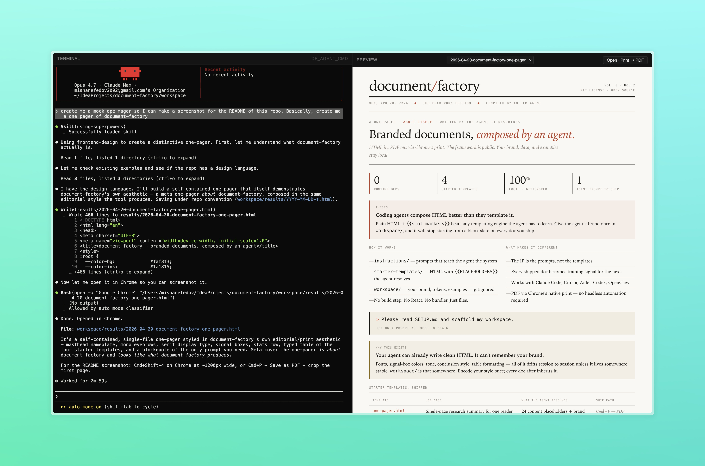

# document-factory


**Your LLM coding agent can write HTML. It can't remember your brand.**
document-factory teaches it — and gives it a two-pane editor to work in.

Branded documents, composed by an agent. HTML in, PDF out via Chrome's native print. Your brand, data, and examples stay on your machine.



---

## What it is

Two things in one repo:

1. **A methodology** — a set of prompts, conventions, and starter templates that teach any coding agent (Claude Code, OpenClaw, Cursor, Codex, Aider, Gemini CLI, Hermes, …) how to produce on-brand documents consistently across sessions.
2. **A self-hosted editor** — a Next.js app that embeds your agent's real terminal next to a live HTML preview. No chat wrapper, no re-implementation of the agent UX — just xterm.js bolted to node-pty, with a file watcher that reloads the preview whenever the agent writes a file.

It's fully agent-agnostic. Any binary that runs in a POSIX shell will work.

---

## Quickstart

### The editor (recommended)

```bash
git clone https://github.com/mishanefedov/document-factory.git
cd document-factory
pnpm install
pnpm -F @document-factory/web dev
```

Open `http://localhost:45367`. Left pane: your agent in a real terminal, rooted at `workspace/`. Right pane: live preview of anything it writes to `workspace/results/`. Agent defaults to `claude`; override with `DF_AGENT_CMD` (see the next section).

### Launching with your agent

The editor just execs whatever binary you point `DF_AGENT_CMD` at, inherits your environment, and pipes bytes. Anything that runs in a POSIX shell works. Verified:

```bash
# Claude Code (default — no env var needed)
pnpm -F @document-factory/web dev

# OpenClaw
DF_AGENT_CMD="openclaw tui" pnpm -F @document-factory/web dev

# Gemini CLI
DF_AGENT_CMD=gemini pnpm -F @document-factory/web dev

# OpenAI Codex CLI
DF_AGENT_CMD=codex pnpm -F @document-factory/web dev

# Cursor agent
DF_AGENT_CMD=cursor-agent pnpm -F @document-factory/web dev

# Aider (args are split on whitespace)
DF_AGENT_CMD="aider --model sonnet" pnpm -F @document-factory/web dev

# Plain shell — for debugging or non-agent workflows
DF_AGENT_CMD=/bin/zsh pnpm -F @document-factory/web dev
```

Requirements: the binary must be on your `$PATH`, and any API keys the agent needs (`ANTHROPIC_API_KEY`, `OPENAI_API_KEY`, `GEMINI_API_KEY`) must already be exported in the shell you launch from — the PTY inherits them. There is no in-app login.

Other flags that influence startup:

| Variable | Default | What it does |
|---|---|---|
| `DF_AGENT_CMD` | `claude` | Binary (with optional args) the terminal pane runs. |
| `DF_WORKSPACE_DIR` | auto-detected repo `workspace/` | Where the agent is rooted; also the file-watcher scope. |
| `PORT` | `45367` | HTTP + WebSocket port. Deliberately high-range. |

### The kit, without the editor

If you just want the prompt framework and prefer running your agent in your own terminal:

```bash
git clone https://github.com/mishanefedov/document-factory.git
cd document-factory
# point your agent at SETUP.md and let it scaffold workspace/
```

Then say to your agent: *"Please read SETUP.md and scaffold my workspace."* It will walk you through brand (name, domain, colors, fonts, logo), audiences, and produce a `workspace/` you can start using.

---

## How the methodology works

```
document-factory/
├── instructions/         ← prompts that teach the agent the system (public, versioned)
├── starter-templates/    ← HTML with {{PLACEHOLDERS}} the agent resolves at setup (public)
├── recipes/              ← prompt shortcuts for common operations (public)
├── examples/             ← reference docs showing what "good" looks like (public, generic)
├── packages/             ← the editor + MCP server + core renderer (public)
└── workspace/            ← your brand, components, tokens, output (private, gitignored)
```

**The IP is the prompts, not the templates.** Starter templates are brand-agnostic HTML anyone could use. The value is in `instructions/` — a routing table (`RESOLVER.md`) that sends the agent to the right instruction file based on intent, plus specs for doc types (`one-pager`, `case-study`, `cover-letter`, `progress-note`), conventions (`filename-convention`, `brand-token-protocol`, `writing-voice-guide`), and rules (`factory-rules`, `component-conventions`).

**The agent reads instructions on demand, not wholesale.** Because the instruction files are small and single-purpose, the agent stays within a manageable context window. It reads `RESOLVER.md`, picks the relevant file, reads that, and writes.

**Your examples become the learning corpus.** Every doc you ship that you drop into `workspace/examples/` teaches the agent what *your* good looks like. Session-to-session drift (different fonts, different tone, different table styles) goes away because the evidence lives on disk.

**Plain HTML beats templating engines.** Coding agents compose HTML better than they learn yet another template DSL. `{{slot markers}}` are enough — the agent resolves them by editing the file directly.

**No build step.** No React, no bundler, no transpile. HTML, CSS, files. Chrome's print dialog is the PDF engine.

---

## How the editor works

```
┌──────────────────────────────┬──────────────────────────────┐
│  TERMINAL                    │  PREVIEW                     │
│  (xterm.js over a WebSocket) │  (iframe, live reload on     │
│                              │   filesystem change)         │
│  your agent, running as you, │                              │
│  cwd = workspace/            │  workspace/results/*.{mdx,   │
│                              │    html} — picker dropdown   │
└──────────────────────────────┴──────────────────────────────┘
```

- **Terminal** — a real PTY spawned via `node-pty`. Whatever you set `DF_AGENT_CMD` to (default `claude`) runs as you, with your `$PATH`, your env vars, your keys. Same capabilities as opening Terminal.app. No sandbox in the default deployment — the agent can edit any file you can, which is the point.
- **Preview** — reads `workspace/results/<slug>.{mdx,html}`, injects a `<base href="/workspace/results/">` and an SSE reload listener, serves it in a sandboxed iframe. Relative asset paths (`../tokens/brand.css`, `../assets/logo.svg`) resolve against the served workspace.
- **Reload loop** — `chokidar` watches `workspace/` for changes. When the agent writes or edits a file, an SSE event fires and the iframe remounts. You see the doc redraw as the agent types.
- **Restart** — one button in the terminal header kills the current agent process and spawns a fresh one without losing the browser connection. Useful when you want a new session without leaving the editor.

See [`packages/web/ARCHITECTURE.md`](packages/web/ARCHITECTURE.md) for wire formats, security posture, and Docker alternative.

---

## Packages

| Package | Purpose |
|---|---|
| [`@document-factory/core`](packages/core) | The renderer. Takes MDX + brand + component registry → HTML. Pure library, no IO. |
| [`@document-factory/web`](packages/web) | The editor. Next.js custom server + xterm.js + node-pty + SSE. This is what you run. |
| [`@document-factory/mcp-server`](packages/mcp-server) | Exposes core operations as MCP tools so any MCP-capable agent can read/write workspace files through a typed interface. |

---

## Philosophy

- **Don't rebuild your agent's UI.** Embed it. The terminal in the editor is *your actual* Claude Code / OpenClaw / Codex session — keybindings, autocomplete, alt-screen apps, everything.
- **Your brand belongs on your machine.** `workspace/` is gitignored. The framework is public because the framework has no secrets in it. Your brand CSS, your examples, your drafts — private.
- **Time-to-first-doc matters more than abstraction depth.** A one-week job in an hour is the benchmark.
- **Zero runtime deps in the core.** The editor uses Next + node-pty (native unavoidable), but the renderer is just string manipulation + `@document-factory/core`. You can consume it standalone.

---

## Status

**v0.2.0 — alpha.** Used daily by the author for Brand Partner Index research publications and Auraqu, Inc. documents. The prompt library is stable; the editor has landed its Phase 3 milestone (terminal + live preview + restart + HTML/MDX dual-mode).

See [`ROADMAP.md`](ROADMAP.md) for what's next, [`CHANGELOG.md`](CHANGELOG.md) for what's shipped.

---

## Contributing

Not accepting PRs during v0.x. The prompt library is still shifting as more document types get shipped in anger. Issues and GitHub Discussions are open — bug reports, architecture questions, "this broke for me," feature proposals, all welcome.

See [`CONTRIBUTING.md`](CONTRIBUTING.md) for the current stance and when PRs will open.

---

## License

MIT — see [`LICENSE`](LICENSE).

---

## Further reading

- [`SETUP.md`](SETUP.md) — paste-ready prompt to scaffold `workspace/`
- [`instructions/RESOLVER.md`](instructions/RESOLVER.md) — how the agent finds the right instruction file
- [`instructions/factory-rules.md`](instructions/factory-rules.md) — the system's axioms
- [`packages/web/ARCHITECTURE.md`](packages/web/ARCHITECTURE.md) — editor internals
- [`packages/mcp-server/SPEC.md`](packages/mcp-server/SPEC.md) — MCP tool surface
- [`ROADMAP.md`](ROADMAP.md) — what's next
